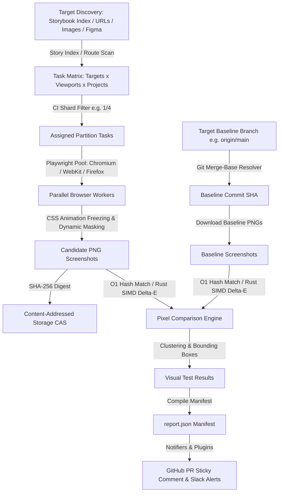

# Execution pipeline

This document details the complete end-to-end execution lifecycle of Diffra's test runner (`runVisualRegression`).

---

## Execution flow diagram

---

## Pipeline phases

1. **Target discovery**: Scans configured drivers (`storybook`, `url`, `image`, `figma`, or custom drivers) to discover testable UI targets without executing component code.
2. **Task matrix & sharding**: Multiplies discovered targets by configured viewports and Playwright projects (`chromium`, `firefox`, `webkit`). Slices tasks if `--shard` is specified.
3. **Headless browser capture**: Launches parallel workers in the `BrowserPool`. Injects deterministic CSS rules to pause animations, hides carets, applies locator masks, and captures PNG screenshots.
4. **Git merge-base & CAS matching**: Computes `git merge-base HEAD <baselineBranch>`. Checks if the candidate SHA-256 hash matches the baseline SHA-256 hash ($O(1)$ fast-path).
5. **Pixel diffing & clustering**: Runs hardware-accelerated SIMD YIQ comparison for differing images and computes bounding boxes.
6. **Manifest compilation**: Compiles a structured `report.json` with branch URLs and links to images.
7. **Notifications & review**: Emits GitHub commit checks, posts/updates sticky PR comments, and sends Slack webhook alerts.
