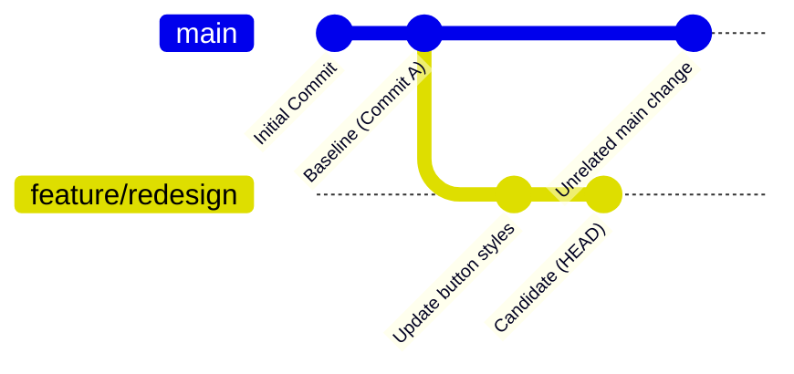

# Baseline management and Git merge-base

Diffra manages baseline screenshots automatically using Git ancestor history and Content-Addressed Storage (CAS), eliminating the need for manual branch syncing or complex baseline database servers.

---

## Git merge-base discovery

When you execute a visual test run on a feature branch, Diffra automatically determines the exact common ancestor commit between your current branch (`HEAD`) and the target baseline branch (`origin/main`):

```bash
git merge-base HEAD origin/main
```



### Why merge-base matters
Comparing against the **merge-base commit** rather than latest `origin/main` HEAD guarantees that tests do not fail due to unrelated changes merged into `main` after your feature branch was created.

---

## Content-Addressed Storage (CAS) and Cloud Storage

In CI/CD environments, baseline images and manifests are persisted in your private cloud object storage (Amazon S3, Cloudflare R2, Google Cloud Storage, or Azure Blob):

1. **Content-addressed hashing**: Every captured screenshot is hashed using SHA-256 (`SHA-256(candidate)`).
2. **$O(1)$ fast path (Zero download)**: Diffra queries the baseline commit manifest in cloud storage. If the candidate hash matches the baseline hash, **the baseline image is never downloaded**. The test passes instantly with zero network bandwidth.
3. **On-demand fetch for diffing**: When candidate and baseline hashes differ, Diffra downloads the baseline PNG directly from cloud storage into runner memory to execute SIMD pixel comparison, compute bounding boxes, and generate the diff highlight image.

---

## Baseline approval workflows

### 1. Local development approval
During local development, approve updated snapshots with a single command:

```bash
pnpm diffra approve
```

This promotes candidate screenshots as approved baselines in `.diffra/baselines/<commit>/` on disk.

### 2. CI/CD automated merge approval
In CI pipelines with cloud storage configured, merging a pull request into `main` signals approval:

* **On pull requests**: Candidate screenshots are compared against the merge-base baseline from cloud storage.
* **On merge to `main`**: Diffra automatically promotes candidate screenshots to cloud storage as the new official baseline for future pull requests.

No CI baseline caching or large binary commits in Git are required.

---

## Shallow clone warning in CI

For Git merge-base resolution to discover the ancestor commit properly in CI runners, ensure the full commit history is available:

```yaml
- name: Checkout repository
  uses: actions/checkout@v4
  with:
    fetch-depth: 0 # Full history required for merge-base resolution
```
